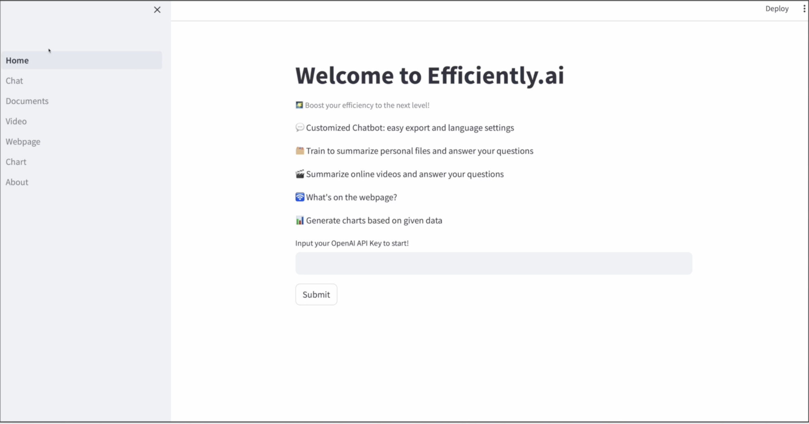
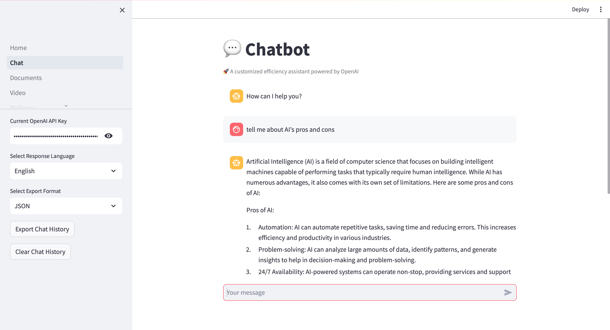
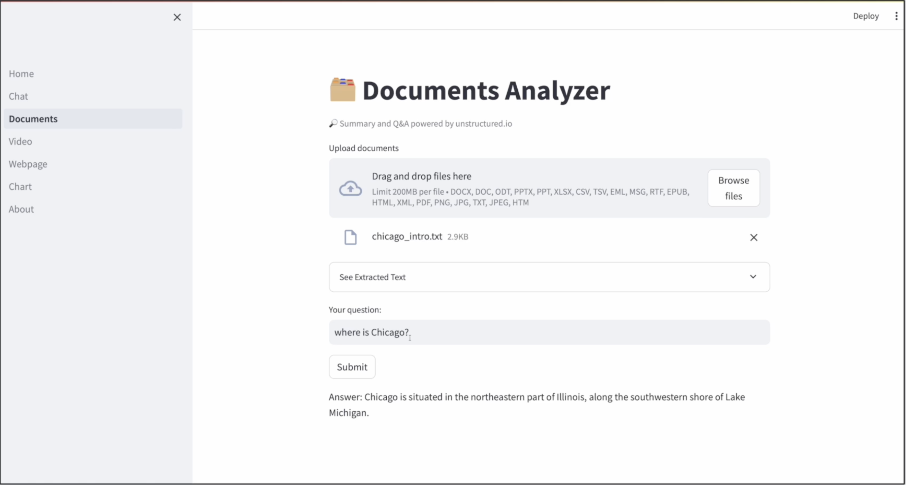
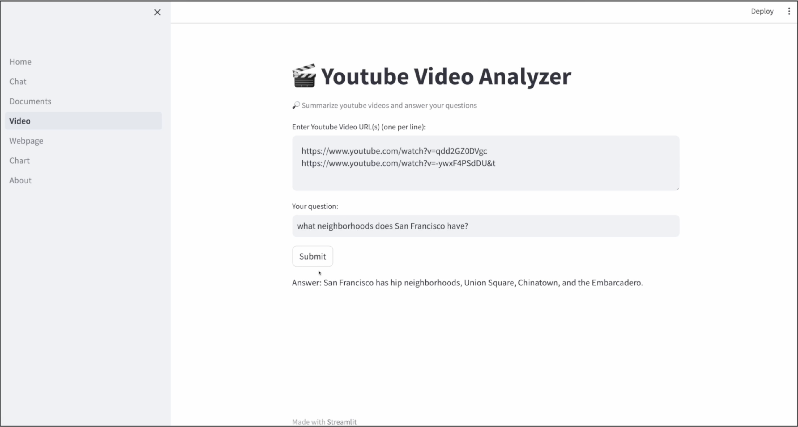
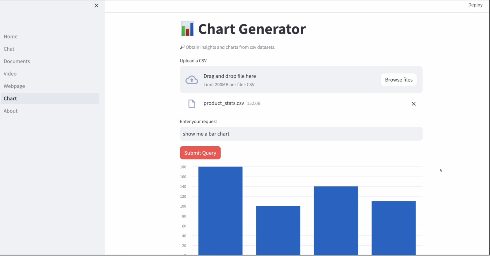
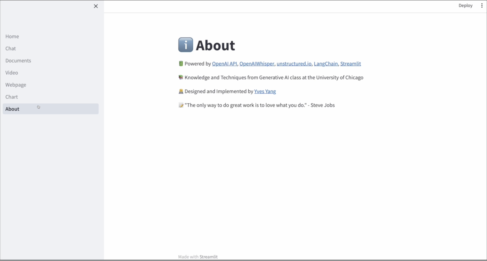

# Efficiently.ai

A Generative AI Application to Boost Your Work Efficiency

- The application features customized chatbot, unstructured documents, youtube urls, and webpage summary, chart generation, etc.
- The application is powered by LangChain, FAISS, OpenAI, Whisper, Unstructured.io, and Streamlit.
- The application includes consideration of Prompt Engineering, Retrieval Augmented Generation, and Responsible AI Moderation.

## Video Demo

## Snapshot

# Technical Details

## Home Page

- Use st.session_state to maintain user key record

## Chat

- Enable multiple response languages selection by modifying model content input
- Enable chat history export and chat histroy easy deletion by manipulating chat messages list
- Enable more responsible AI behavior by applying addtional layer of moderation on user input
- Implement simple prompt engineering to improve quality of the model output

## Documents

- Utilize tempfile to resolve issue with unstructured.io's failure at processing uploaded file at streamlit server
- Extract text data from various formats using unstructured.io
- Enable more responsible AI behavior by applying addtional layer of moderation on user input
- Utilize FAISS and OpenAIEmbeddings for documents data embedding
- Utilize LangChain's PromptTemplate and load_qa_chain to conduct Prompt Engineering and Retrieval Augmented Generation, enable the model's focus on provided documents and context only

## Video

- Extract scripts from video urls using YoutubeAudioLoader and OpenAIWhisperParser
- Utilize FAISS and OpenAIEmbeddings for documents data embedding
- Utilize LangChain's PromptTemplate and load_qa_chain to conduct Prompt Engineering and Retrieval Augmented Generation, enable the model's focus on provided videos and context only

## Webpage

- Extract html content from webpage using requests and BeautifulSoup
- Generate summary using OpenAI API

## Chart

- Extract data from csv file using LangChain's pandas_dataframe_agent
- Generate standardized JSON style output using Prompt Engineering
- Encode the model's string output to JSON using json package
- Chart generation with the help of streamlit chart functions

## About

- Easter Egg: Generate a Daily Quote using OpenAI API
